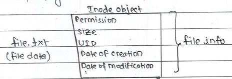

# File Management Subsystem

**Need:** 
- To access file present in physical memory or virtual memory

- There are three types of files present in Linux os.

    1. Normal files
    2. Special files
    3. Device files

## 1. Normal Files

- There are two types of normal files

    **a)** Texttual files
    
    **b)** Binary Files

#### a) Textual Files
----
- For accessing textual files we have text editors. Text editors are two types:
 i) CLI Text editors(vi, vim) ii) GUI base Text editors (gedit, editplus)

 - Textual files are saved with extension of  .c, .txt, .s, etc.....

#### b) Binary Files
---
- Binary files are saved with extension of .o, .out, ls, ps, mp3, mp4, .jpg 
- For accessing binary files we have separate applications for each of these

     .o, a.out  &rarr; objdump

     .mp3 &rarr; mp3 player

     .jpg &rarr; image viewer

## 2. Special Files

- Contains IPC objects, named pipes and FIFO's multiple process cannot directly shares data they need IPC mechanism

## 3. Device Files

- In linux user space, every device file is seen as device nodes. They are present in /dev directory. Device files are also called as device nodes.


**Q) How User space application sends request to hardware?**

- An application can never send request directly to hardware. It uses system call (i.e, basic i/o calls) to interact with the drivers. 

**Q) How do you make sure that only request to particular driveer is sent?**

- Every drivers has unique device files and the application has to use basic i/o calls on device file to send request to particular driver and particular driver initiates the corresponding hardware. This concept is applicable fpr windows, android, etc.. as they all have user space as well as kernel space.

    #### Serial port
    ---
    - Serial ports are needed for the serial communication.
    - Serial port uses the device file **tts0** present in **/dev** directory.

    #### Parallel Port
    ---
    - Parallel ports are used in printers.

    - Parallel port &rarr; /dev/parport

    #### Hard disk
    ---
    - Hard disk &rarr; /dev/sda       (sda0, sda1)
            
        - /dev/sab &rarr; 2nd hard disk
        - /dev/sac &rarr; 3rd hard disk
    
    **Note:**
    - Every device will have corresponding device file in /dev directory. Whenever we think about anu device immediately look for the corresponding file in /dev directory.

    - Basic i/o calls are called universal i/o calls because it is used to access the normal files, special files and device files.

    - Basic i/o calls are:   open(),  close(), read(), write(), ioctl(), fcntl().

    **Note:**   We cannot perform read and write operation until unless we open the file

    ## Open() System Call
    ```
    Syntax: open(Name of file, Modes, Permission in octal form);


    Syntax: open("file.txt", O_RDWR, 064);

    ```
    - Permissions are needed when we are creating the file.
    - Integer values can be expressed in:
        
        1. Decimal &rarr; Used for general calculation.
        2. Octal &rarr; For applying permission to files of various system resourses
        3. Hexadecimal &rarr; For address (Physical/Virtual).
    - fork(), exec() family calls send the request to the process management subsystem in kernel space
    - Basic i/o calls send request to the file management sub-system in kernel space.

        

    - open() calls invokes the sys_open() which sends request to the driver to search the file name "file.txt", in the hard disk. The kernel is going to search the file name file.txt

    - Device Drivers are classified into 3 types
        
        1. Character device driver
        2. Block device driver
        3. Network device driver.

    - Character device uses character drivers and apporoximate 80% devices are character devices.

    - Block device uses block drivers e.g, Hard disk, USB, Pendrive. It is also called as Mass Storage Device.

    - Network device uses network drivers. eg, LAN port. The alternative name of network device is NIC (Network Interference Calls).

    -  When the kernel finds the file.txt file. It has inode corresponding to it(i.e, .txt file)

        
    - The information about the file get stored inside the inode object. Inode object of type **struct inode.** 

    - File information contains the information about the file, whereas file data contains the content of the file.

    - Hard disk is divided into Blocks and Sectors.
        
        - Collection of sectors are called blocks.
    - File data get stored in the sectors which is a part of a blocks and the file information is stored in the inode object, and it is also stored in the sectors of Hard disk.

    **Q) Kernel uses which object to represent a file?**

    - Kernel uses inode object too represent the file

    **Q) From user space can we access the file information present in inode object?**

    - Yes, There are 2 types:
        
        1. Using commands from terminal applications

            - **ls -l** Shows the information about each and every file, and the entire information is comming from inode object. 
        
            **Note:**
            - Each file has corresponding inode present in the hard disk . Each inode object will have unique ID and it can be observed using **ls -il**
        2. By using Basic I/O calls form applications
        
            - stat() and fstat()

    **Q) Which system call is used to access the file information? (or) ls command internally uses which system call to access the file information?**
    
    - stat() and fstat() 

    **Q) What happens after kernel finds its inode object?**
    
    1. Inode object corresponding to file get copied from hard disk to the kernel space of RAM.
    2. Kernel creates a new object called file object the kernel content of file objects are:

        

        - It also contains the base address of inode kernel uses file object to represent the open files.
        - Whenever the file is created the inode correspondig to file is created but kernel object i.e, file object is created only when we open the file.

    **Q) Difference between primary data and other members of file object?**

    - All the other members are filled/ or used/ or accessed by the kernel but the primary data is not used by the kernel it is used by the drivers.
    - Modes are present in file object and the permissions get stored in struct inode.

    3. The file object base address get stored in fd tavle.
        
        - The first three entries off fd table is stdin, stdout, and stderr and it is inherited from parent process. The base address starts from 4th position indexed 3 onwards in fd table. 

            

        **Q) When fd Table is created?**
        
        - Whenever the process is executed, PCB get created in kernel space of RAM and fd table is the part of the PCB.
        - fd table has nothing to do with open system call.

        **Q) What is the size of fd table?**
        
        - o to 1024

        **Q) When file object is created?**

        - When open() system call is invoked, file object is created.

    - Finally open system call returns index to the table where new entry is created. The indec to the fd table is called fd or file discriptor.

    **Q) What does open() returns?**

    - It returns the value called fd or file discriptor. fd is the index to the fd table which stores the new entries.

    **Q) When file is open() first time in your program what is returns?**

    - 3  (as 0,1,2 is already inherited from parent process/or shell program in fd table).

- **Once we get fd we can do read and write operations.** 
