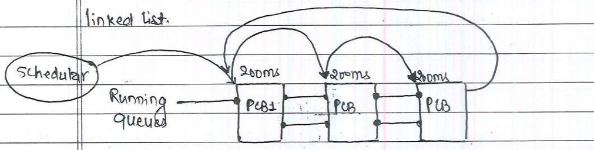
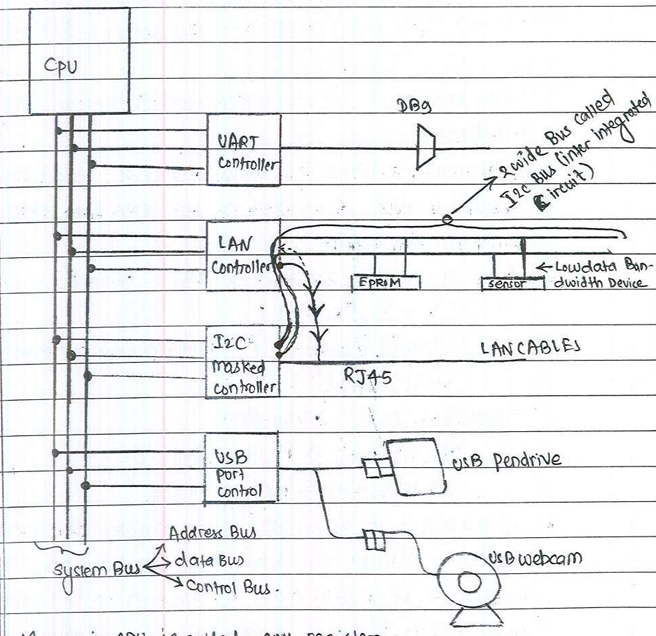

# SIGNALS
---
- Signal is an event generated by unique system inresponse to a process or a condition.
- Signal is send to process upon receving the signal, the process inturn takes some action.
- There are all together 64 signals each signal has their name and signal number.
- Signals are produced when: 

    1. **Special key combinations are used in terminal application.**
    
        - ctrl + c => Terminates the process (Generate SIGINT);
        - ctrl + z => Suspends the process (Generate SIGTSTP).
    - Signal list can be displayed by uding command **kill -l**
    2. **CPU is executing invalid, illegal or special previlidge instructions i.e, Exceptions.**

    - Once the suspended process is resumed then program again starts from the location where it had been suspended.

    **Schedular:** It is a program which decides which process to run.
    - All the PCB are maintained as the nodes of the linked list.

        
    - Every process is given CPU time calld **time slice**. If in givrn time slice process executes successfully then respective process get terminated from RAM. But if the process has not completed within given time slice CPU stops running the current process aand goes to next process.
    - Completing all the process and come back to the 1st process is called cycle.
    - In Round robin scheduling every process will get equal CPU time.
    - When the program encounters the blocking calls like: 

        - scanf()
        - gets()
        - wait()/waitpid()
        - sleep()
    - The process goes into blocking state and PCB which are running queue goes into waiting queue. ad once the PCB is in waiting queues schedular is not going to assign any CPU time to that process. Once the blocking calls expires, the PCB again moves into the running queue. 

        

    
    **Q) When signals can generated?**

    - CPU executing invalid,illegeal or special privelidged instruction i.e, Exceptions

    - To understand this point first we have understand the **"Exceptions"**

    ### Introduction about Exceptions
    ---
     
        
    

     - Memory in CPU is calles CPU registers.
     - CPU interface to our peripheral/via system bus.
     - Each i/o controller/ peripheral/ Device has set of register.
     - These register size 8 bit/ 16 bit/ 32 bit
     - **The information about the "registers of an i/p controller" found in "Data sheet/ Hardware manual".**

     