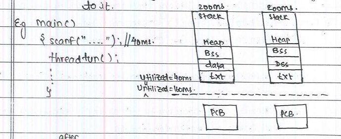

# THREADS
---

- Def: To run a multiple parallel tasks within a process, we use threads.
- Every process by default has single theread .i.e, main thread.
- The main thread starts execution from main function.
- when we are dealing with threads you must know about:

    1. Entry point
    2. Context info
    3. Stack area
    4. CPU time
- In programmer point of view every function has set of instructions enclosed within curly barces i.e, { }
- If any process is not completely executed by the CPU in a given time slice then control goes to the next process and the  phenomenon is called **premption**. 

    **Reasons for pre-emption:**

    1. When the cpu time expires. the cpu even goes to the next process.
    2. When we use blocking calls the control again goes to the next process.
    3. Whatever there is hardware interrupt. the process stops and control moves to the interrupt handler.
    4. When priority task is created, the control goes to it.
- In real time operating system every process is called task.
    

- When after 40ms, scanf() is used as then process-2 will be executed by CPU, but process-1 remains unutilized for 160ms.
- Inorder to effective utilize that remaing time we use threads.

    **Q)How do you create new thread?**
    
    - pthread_create is a library function which is used to create a thread. It is defined in libthread.so Internally every library function invokes system call and it invokes clone() system call. Hence clone() is a system call use for creating thread.

    **Note:**
    - From used point of view every function is multiple statements enclosed within {} baces, but from system point of view every function has instructions present in text/code segment.
    
    **Q)Why we are using pthread_create() insted of clone() for creating a thread?**
    - Because the arguments to clone() system call is complex and need alot of understanding.

    #### Compilation of a thread.
    ---
    - Compiler by default has only acccess to c-standard library functions. The compiler will not have any access to other libraries.

    ```
    like    libc.so
            libpthread.so
            libnt.so
            libm.so
            librt.so

        Default path for library function is /lib
    ```
    - Compiler can access to other library only when we provide some information about the compilation. The information passed is library name, The actual name used for above library is **"so nmae"** (Shared object name) is a just library name.
    - The name in between lib and so is called so name.
    - So, compilation **gcc -lpthread file.c** (or)  **gcc file.c -lpthread**. Here **'-l'** indicates the library.
## Arguments of pthread_create
```
main(){
    pthread_t ti;
    pthread_create(&ti,NULL,threadfun,"....");
}
```
- pthread_t is a type of **"typedef unsigned int"**

### 1st argument: (&li)
---
- It is address of a variable of type "pthread_t". Initially it is empty.
- It is a "Thread Identifier".
- It is created locally but it did not contain any valid value it is empty.
- **"ti"** Contains valid thread infromation, used in all sebsequent calls related to thread operations.
- The os stores all the information about threads inside the thread table.

    
- In thread table each entry contains information about thread.
### 2nd Argument(NULL):
----
- it id for flags.

### 3rd Argument(threadfun):
----
- Every thread has entry point, i.e, threadfun
- The entry point of thread can accept only **"Single argument"** it cannot accept multiple arguments.
- Thread entry point must accept only one arguments.
    ```
    void *threadfun(void *arg){
        -----
        -----
        -----
    }
    ```
**Note:**

- We need void pointer because it is a generic pointer and it can accept any data type.

### 4th Argument(i.e, .....)
----
- Here we can pass 

    - Base address of normal variable int/char
    - Base address of structural variable
    - Base address of normal arrays
    - Base address of structural arrays
    - Base address of strings.

- We can pass anything here, whatever is passed as an argument here is passed as an argument to thread entry point. so, from here we are passing the base address to 3rd argument thus the argument of the thread function is of pointer type to hold the address. i.e, void *arg in **void *threadfun(void* arg)**
- The string which are passed as an argument to function, and the string which are stored using pointers are stored in rodata segment

- Initially **"ti"** has no valuable information,but once the pthread_create executes successfully, then it contains valid thread identifier. The corresponding  it is used in all subsequent calls related to thread operation pthread_create is responsible for creating a thread at the same time it creates entry in the thread table maintained by kernel.
    

**Note:**

- Function name gives the base address of function.

- In cae of no blocking call the given CPU time to process is splitted equally among its multiple threads.
    

**Q) Why stack grows?**

1. When a function invoke a block of memory is created in stack is called **"Stack frame"**.
2. When a new thread is created a block of memory is created in stack is called **"stack area"**.
- By default 2MB stack area got create and we can increase the size also. stack area internally contains stack frames.

**Q) What segments are shared by multiple threads within a process?**

- Segments are: 
    
    1. text segment
    2. Data segment
    3. BSS segment
    4. Headp segment

    - But the stack segment is not shared.

- pthread_create() is a library function, not a system call. which is present in libpthread.so library.
- Every library call invokes a system call. pthread_create() is library call which invokes clone() system call.
- Entry point is a function where thread execution starts. it always accept only onr argument which is type of **"void pointer"**

    ```
    -->  pthread_crete(&ti,NULL,threadfun,"Hello");


    void *threadfun(void *arg){
        cahr *sptr=(char *)arg;
        printf("%s,sptr);
        return strlen(sptr);
    }
    ```
**Q) How to fetch the thread entry point return value in your main thread?**

- It can be found in the **2nd argument of the pthread_join().** 

**Example Code:**
    
```
#include<stdio.h>
#include<pthread.h>
#include<string.h>
int main(){
    pthread_t ti;
    pthread_create(&ti,NULL,threadfun,"Hello");
    printf("Main\n");
}

void *threadfun(void *arg){
    char *ptr;
    ptr=(char *)arg;
    printf("%s",ptr);
    return strlen(ptr);
}

OUTPUT:
Main

```
**Rule:**

- Once the main funcntion complete, main thread trminates. Once the main thread terminates, the entire process terminates. i.e, Other threasds running with the process also terminates.

**Q) How main thread blocks until the new threads execution completes?**

- By using  library functions **"pthred_join()"**. 
- pthread_join() is a blocking call. It accepts two arguments. Which is also present in libpthread.so
    ```
    pthread_join(ti,&res);

            (or)

    pthread_join(ti,retun values of entry point);
    ```
**Example code:**


    #include<stdio.h>
    #include<string.h>
    #include<pthread.h>
    int main(){
        pthread_t ti;
        pthread_create(&ti,NULL,threadfun,"Hello");
        int res;
        pthread_join(ti,&res);
        printf("Main\n");
        printf("Thread exit code: %d\n",(int)res);
    }

    void *threadfun(void *arg){
        char *ptr;
        ptr=(char *)arg;
        printf("%s\n",prt);
        return ptr;
    }

    OUTPUT:
    Hello 
    Main
    Thread exit coe: 5
    
- To execute this program we have to use command **gcc -lpthread filename.c**

# Context Info

- To understand this concept, first we know about context switching

### Context Switching

- Context switching is nothing but the CPU changing from one process to another process.
- Context switching is a process where a CPU saves the state of a running process or thread (its "context") and loads the state of another process to resume its execution, enabling multitasking by making it appear as though multiple programs are running simultaneously. This involves storing CPU registers, the program counter, and other information in a Process Control Block (PCB) so that the interrupted process can be resumed from the exact point it left off. 

    

**Q) From which instruction CPU starts process execution.?**

- To understand this , first understand about CPU Registers.


### CPU Registers


- CPU registers are high-speed memory units essential for efficient program execution, enabling quick access to frequently used values involved in processing. They play a crucial role in data manipulation, memory addressing, and tracking processor status. While accessing instructions from RAM is faster than from a hard drive, it's still not quick enough for the CPU, which is why registers are used to store and retrieve data faster. They work in coordination with the CPU's memory to optimize processing, with cache memory being the next step in speed, though still slower than registers. Each class of CPU registers, from general-purpose to status and control registers, supports specific tasks to ensure smooth and rapid execution of operations.

- R0 - R12 is called General Purpose Registers contains normal data.
- R13 - R15 is called Special purpose registers.
- R13 - stack Pointer
- R14 - Link Register
- R15 - Program counter.
- All these CPU registers are 32bit registers.
- The data read from the RAM to CPU registers by using LDA (load) instruction.
- From CPU to ALU and ALU perform ths arthemetic anf logical operations and the result is put back to CPU registers.
- From CPU registers put back to RAM by using STR (store) instruction.

**Program Counter:**

-  Program Counter (PC) is used to keep the track of the execution of the program. It contains the memory address of the next instruction to be fetched. PC points to the address of the next instruction to be fetched from the main memory when the previous instruction has been successfully completed. Program Counter (PC) also functions to count the number of instructions. The incrementation of PCs depends on the type of architecture being used. If we are using a 32-bit architecture, the PC gets incremented by 4 every time to fetch the next instruction.

**Stack Pointer:**

- The stack PCs pointer points to the top of the stack, which is a part of the memory used to store function calls and other operations.

**Link Register:**

- A link register (LR for short) is a register which holds the address to return to when a subroutine call completes.
- It contains the next instruction address.

**Note:**

- Program counter always contains instructions base address.
- CPU fetch the instruction present in the program counter.
- The address peresnt in the program counter auto incremented by CPU

**Pipelining stages:**
1. Fetche
2. Decode
3. Execute.

**Q) How CPU execute instructions?  (or) What happens when main function is invoked?**

- Memory got created in RAM(i.e, Memory segment + PCB)


- In system point of view every function has set of instructions in text segment
- In ARM arcitecture, the function invokation or subroutine incokation get started to BL(Branching and Linking) assembly code.

```
    BL main --> function base address(0x0000) it can be obtained by writting name of function and it is the base address of the instruction in the text segment.

If CPU executing the corresponing base address then 0x0000 is moved to the program counter.
```


**Q) When the address incremented in program counter?**

- Once the CPU fetch instruction from program counter, the program counter contains next instruction address.

### Stack Pointer

- It contains the address of top of the stack.

    

- Once the CPU completes the execution of process-1 then move to process-1, at this time all CPU registers are lost information about process-1.

    **Q) I dont want to lost the information of process-1 during context switching, What can i do?**

    - Once CPU time expires, we need to keep a backup of all CPU registers information.

    **Q) Where we are copy all these CPU registers information during context switching.?**

    - The CPU registers contents has to copied to some locations in your RAM. i.e, **"Context area"**.
    - Context area present in the PCB.

    **Q) During the context switching, which instruction will be used to copy the content of CPU register to your context area of PCB?**

    - STR Instruction.
- When the CPU comes back to process-1, it should start execution from the same location where is was stopped previously and it can be known by looking into program counter, but this time contents are present in the context area of that process PCB. Therefore the content of context area has to be loaded to CPU register by executing LDR intruction.
